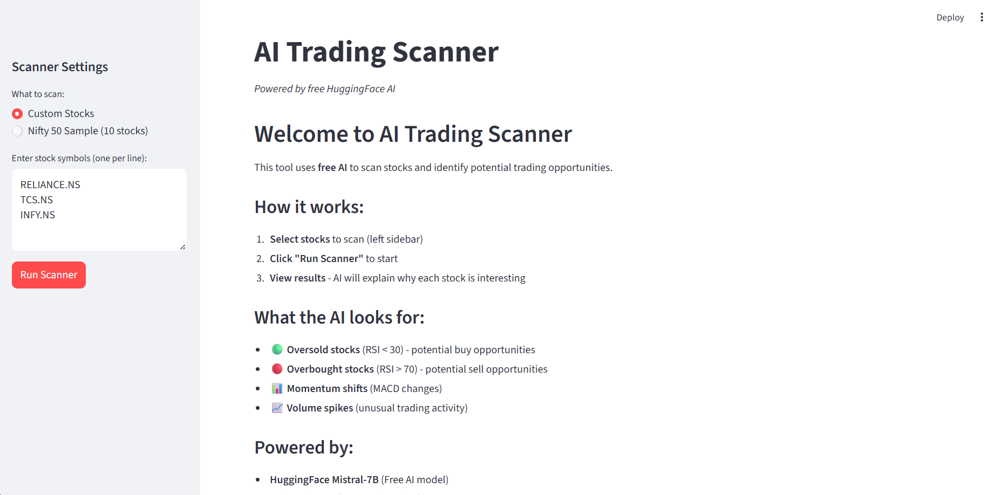
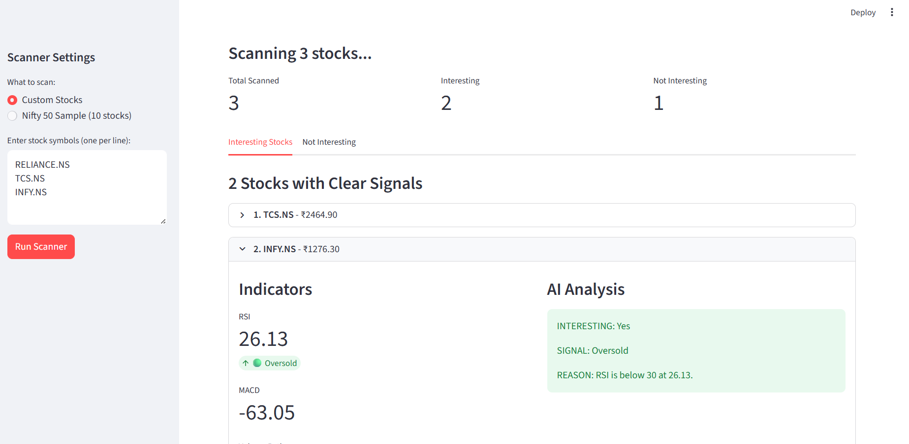
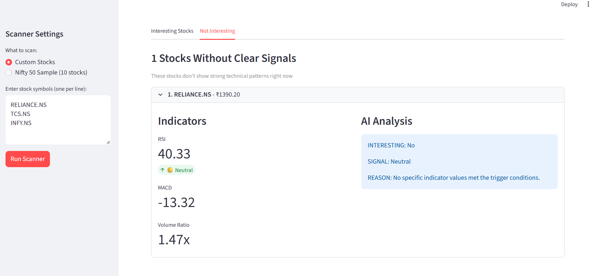
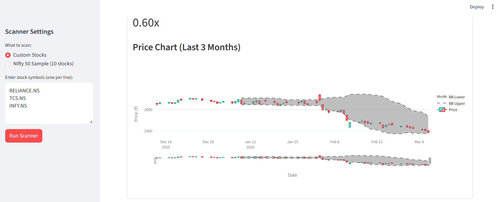
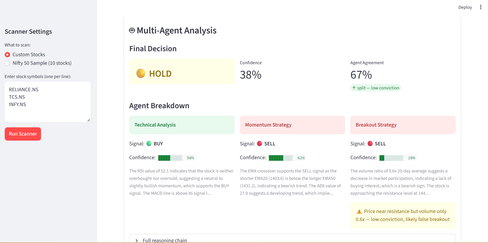

# 🤖 AI Trading Copilot

<div align="center">

[](https://www.python.org/downloads/)
[](https://github.com/langchain-ai/langgraph)
[](https://streamlit.io/)
[](https://huggingface.co/)
[](https://opensource.org/licenses/MIT)

**An intelligent trading system that uses free AI to scan stocks and identify trading opportunities**

[Features](#-features) • [Demo](#-screenshots) • [Quick Start](#-quick-start) • [How It Works](#-how-it-works) • [Tech Stack](#-built-with)

</div>

---

## 🎯 What This Does

Scans stocks using **100% free AI** to find potential trading opportunities based on technical indicators:

- 📊 **Calculates indicators** - RSI, MACD, Bollinger Bands, Volume analysis
- 🤖 **AI analysis** - Meta Llama-3-8B explains why each stock is (or isn't) interesting
- 📈 **Visual dashboard** - Beautiful Streamlit interface with interactive candlestick charts
- 🎯 **Smart filtering** - Shows both interesting stocks AND why others were skipped
- 💯 **100% Free** - No API costs, uses open-source HuggingFace models

**Example output:**
```
✅ RELIANCE.NS - ₹2,847.50
RSI: 31.24 (Oversold 🟢)

AI Analysis:
INTERESTING: Yes
SIGNAL: Oversold Reversal
REASON: RSI at 28 (oversold) with positive MACD suggests potential bounce.
```

---

## 📸 Screenshots

### Dashboard Overview
> *Clean, professional interface for scanning stocks*



### Scanner Results - Interesting Stocks
> *AI identifies stocks with clear technical signals*



### Not Interesting Stocks - Full Transparency
> *See why AI skipped certain stocks*



### Interactive Price Charts
> *Candlestick charts with Bollinger Bands and indicators*



### Multi-Agent Dashboard
> *AI identifies stocks with clear technical signals*



**📹 Demo Video Coming Soon!**

---

## ✨ Features

**Sprint 1 - Complete ✅**

* ✅ **Market data collection** - Fetches stock prices from Yahoo Finance
* ✅ **Technical indicators** - RSI, MACD, Bollinger Bands (manual calculation)
* ✅ **AI Scanner Agent** - Uses free HuggingFace Llama-3-8B model via `InferenceClient`
* ✅ **Strict classification** - Pre-computed trigger hints prevent AI from over-flagging
* ✅ **Rule-based fallback** - Works even if AI model is unavailable
* ✅ **Streamlit Dashboard** - Professional UI with interactive charts
* ✅ **100% Free** - No API costs

**Sprint 2 - Complete ✅**

* ✅ **Multi-agent orchestration** - LangGraph StateGraph coordinates 3 specialized agents in parallel
* ✅ **TechnicalAnalysisAgent** - Oscillator signals (RSI, MACD, Bollinger Bands)
* ✅ **MomentumStrategyAgent** - Trend-following via EMA crossovers and ADX strength gate
* ✅ **BreakoutStrategyAgent** - Volume-confirmed price breakout detection with ATR validation
* ✅ **Typed state management** - Single `TradingState` schema flows through entire agent pipeline
* ✅ **Confidence scoring** - Weighted aggregation with agreement penalty prevents low-conviction trades
* ✅ **Explainable decisions** - Every final signal includes per-agent reasoning breakdown
* ✅ **Multi-agent dashboard** - Per-agent signal cards, confidence bars, and full reasoning chain in UI
* ✅ **Multi-agent classification** - "Interesting" tab driven by 3-agent consensus, not single scanner

## 🔜 Upcoming Sprints

* **Sprint 3:** Risk management engine (Kelly Criterion, position sizing)
* **Sprint 4:** Paper trading via Upstox API
* **Sprint 5:** Trade journal & analytics (PostgreSQL)
* **Sprint 6:** Production deployment (Docker, CI/CD)

---

## 🛠️ Built With

<div align="center">


</div>

**Core Technologies:**
- **Language:** Python 3.11+
- **AI Framework:** LangChain, LangGraph
- **AI Model:** Meta Llama-3-8B-Instruct (free via HuggingFace)
- **Data:** yfinance (market data), pandas, numpy
- **UI:** Streamlit, Plotly (interactive charts)
- **Dev Tools:** pytest, python-dotenv

---

## 🚀 Quick Start

### Prerequisites

- Python 3.11+ 
- pip
- Free HuggingFace account

### Installation

**1. Clone the repository**
```bash
git clone https://github.com/sohansputhran/ai-trading-copilot.git
cd ai-trading-copilot
```

**2. Install dependencies**
```bash
pip install -r requirements.txt
```

**3. Get your free HuggingFace token**

1. Sign up at [huggingface.co/join](https://huggingface.co/join) (free, no credit card)
2. Go to [huggingface.co/settings/tokens](https://huggingface.co/settings/tokens)
3. Create a new **Read** token
4. Visit [huggingface.co/meta-llama/Meta-Llama-3-8B-Instruct](https://huggingface.co/meta-llama/Meta-Llama-3-8B-Instruct) and **accept the license** (required for Llama access)
5. Copy the token (starts with `hf_...`)

**4. Set up environment**
```bash
# Copy the example
cp .env.example .env

# Edit .env and add your token
# HUGGINGFACE_API_TOKEN=hf_your_token_here
```

**5. Run the dashboard**
```bash
streamlit run streamlit_app/app.py
```

Open http://localhost:8501 in your browser! 🎉

---

## 🎓 How It Works

### Architecture

```
┌──────────────────────────────────────────────────────────┐
│              Streamlit Dashboard (UI)                    │
│   - Stock selection & scan controls                      │
│   - Interesting / Not Interesting tabs                   │
│   - Per-agent signal cards + confidence bars             │
│   - Interactive candlestick charts                       │
└─────────────────────┬────────────────────────────────────┘
                      │
┌─────────────────────▼────────────────────────────────────┐
│           Multi-Agent Orchestration Layer                │
│              (LangGraph StateGraph)                      │
│                                                          │
│  ┌─────────────────┐  ┌──────────────┐  ┌────────────┐ │
│  │  Technical      │  │  Momentum    │  │  Breakout  │ │
│  │  Analysis Agent │  │  Strategy    │  │  Strategy  │ │
│  │  RSI/MACD/BB    │  │  EMA + ADX   │  │  Vol + ATR │ │
│  └────────┬────────┘  └──────┬───────┘  └─────┬──────┘ │
│           └──────────────────┼─────────────────┘        │
│                              │                           │
│                   ┌──────────▼──────────┐               │
│                   │     Aggregator      │               │
│                   │  Weighted scoring + │               │
│                   │  agreement penalty  │               │
│                   └──────────┬──────────┘               │
└──────────────────────────────┼───────────────────────────┘
                               │
┌──────────────────────────────▼───────────────────────────┐
│                  Data Pipeline Layer                     │
│   - Market data (Yahoo Finance / yfinance)               │
│   - Technical indicators: RSI, MACD, BB, EMA, ADX, ATR  │
│   - Scanner Agent (HuggingFace Llama-3-8B)               │
└──────────────────────────────────────────────────────────┘
```

### Step-by-Step Flow

**1. Data Collection**
```python
collector = MarketDataCollector()
data = collector.fetch_data("RELIANCE.NS", period="3mo")
# Returns: DataFrame with Open, High, Low, Close, Volume
```

**2. Calculate Indicators**
```python
calculator = SimpleTechnicalIndicators()
data_with_indicators = calculator.calculate_all(data)
# Adds: RSI, MACD, Bollinger Bands, Volume MA
```

**3. AI Analysis (with fallback)**
```python
scanner = MarketScanner()
results = scanner.scan(["RELIANCE.NS", "TCS.NS", "INFY.NS"])
# For each stock:
#   - Tries AI analysis first
#   - Falls back to rules if AI fails
#   - Returns ALL results with reasoning
```

**3b. Multi-Agent Analysis**
```python
orchestrator = MultiAgentOrchestrator(
    technical_agent=TechnicalAnalysisAgent(llm_client=...),
    momentum_agent=MomentumStrategyAgent(llm_client=...),
    breakout_agent=BreakoutStrategyAgent(llm_client=...),
)
multi_result = orchestrator.analyze(symbol, market_data, indicators)
# Returns: TradingState with per-agent analyses + final aggregated signal
# final_signal: BUY/SELL → "Interesting" | HOLD → "Not Interesting"
```

**4. Display in Dashboard**
```bash
streamlit run streamlit_app/app.py
# Shows:
#   - Tab 1: Interesting stocks (BUY/SELL from multi-agent system)
#   - Tab 2: Not Interesting (HOLD or low-confidence signals)
#   - Each stock: per-agent breakdown + confidence + full reasoning
```

---

## 📊 Technical Indicators Explained

### RSI (Relative Strength Index)
- **Range:** 0-100
- **< 30:** Oversold 🟢 (potential buy opportunity)
- **> 70:** Overbought 🔴 (potential sell/caution)
- **30-70:** Neutral 🟡

### MACD (Moving Average Convergence Divergence)
- **Positive:** Bullish trend (momentum up)
- **Negative:** Bearish trend (momentum down)
- **Crossover:** Potential buy/sell signal

### Bollinger Bands
- **Upper Band:** Price + 2× std deviation
- **Lower Band:** Price - 2× std deviation
- **Price near upper:** Potentially overbought
- **Price near lower:** Potentially oversold
- **Bands squeeze:** Low volatility (breakout coming)

### Volume Ratio
- **> 2.0x:** Unusual activity (institutional interest?)
- **1.0-2.0x:** Normal trading
- **< 1.0x:** Below average (low interest)

---

## 🤖 AI Model & Fallback System

### Primary: Meta Llama-3-8B-Instruct

**Why this model?**
- ✅ 100% free (no API costs)
- ✅ Open-source and reliable
- ✅ Strong instruction-following
- ✅ Good at structured output

**Fallback Chain (if primary fails):**
1. `meta-llama/Meta-Llama-3-8B-Instruct`
2. `google/flan-t5-large`
3. `HuggingFaceH4/zephyr-7b-beta`
4. **Rule-based logic** (always works)

### Smart Fallback System

**Per-stock fallback:**
```python
# For each stock:
try:
    analysis = ai_model.analyze(stock)  # Try AI
except:
    analysis = rule_based_analysis(stock)  # Fallback to rules
    
# Scan always completes!
```

**Rule-based logic uses:**
- RSI thresholds (< 30, > 70)
- MACD signals (positive momentum)
- Volume spikes (> 2x average)
- Combined conditions (e.g., oversold + positive MACD)

---

## 🧪 Testing

### Unit tests — no external dependencies needed
Tests state schema, agent signal logic, and aggregator math. Runs instantly with just `pytest` and `structlog`.
```bash
pytest tests/test_agents.py -v
```

### Integration tests — requires LangGraph
Tests the full LangGraph pipeline end-to-end using mock agents. Auto-skipped if LangGraph is not installed.
```bash
pytest tests/test_orchestrator.py -v
```

### Run all tests
```bash
pytest tests/ -v
```

---

## 📁 Project Structure

```
ai-trading-copilot/
├── src/
│   ├── agents/
│   │   ├── scanner_agent.py        # AI scanner using HuggingFace
│   │   ├── state.py                # TradingState schema (LangGraph)
│   │   ├── base_agent.py           # Abstract base for all agents
│   │   ├── technical_agent.py      # RSI/MACD/BB oscillator agent
│   │   ├── momentum_agent.py       # EMA crossover + ADX trend agent
│   │   ├── breakout_agent.py       # Volume + ATR breakout agent
│   │   ├── aggregator.py           # Weighted multi-agent aggregator
│   │   └── orchestrator.py         # LangGraph StateGraph coordinator
│   ├── data_pipeline/
│   │   ├── collector.py            # Fetches stock data (Yahoo Finance)
│   │   └── indicators.py           # Technical indicators (manual calculation)
│   └── utils/
│       └── config.py               # Loads environment variables
├── streamlit_app/
│   └── app.py                      # Dashboard UI
├── tests/
│   ├── test_agents.py              # Unit tests (no external deps)
│   └── test_orchestrator.py        # Integration tests (requires LangGraph)
├── requirements.txt                # Python dependencies
├── .env.example                    # Environment template
└── README.md                       # This file
```

---

## 💼 Why This Project Matters

### Skills Demonstrated

This project showcases:

✅ **AI Engineering** - Multi-agent systems, prompt engineering, model selection & fallback strategies  
✅ **Production Code** - Error handling, fallbacks, logging, type hints, modular design  
✅ **Data Engineering** - Real-time pipelines, caching strategies, data validation  
✅ **Full-Stack Development** - Backend (Python), Frontend (Streamlit), API integration  
✅ **Problem Solving** - Built free AI solution when paid APIs weren't viable  
✅ **Domain Knowledge** - Financial indicators, technical analysis, trading concepts  

**Tech Stack:** Python, LangChain, LangGraph, HuggingFace, Streamlit, Pandas, NumPy, Plotly, Git

### Learning Journey

Built over **4 weeks** as part of 12-week AI Engineering learning project:
- Sprint 1: Real-time data pipelines, technical indicators, first LangGraph agent
- Sprint 2: Multi-agent orchestration, parallel StateGraph, confidence scoring, explainable AI
- Implemented production-grade error handling and fallback chains throughout
- 21 passing tests (unit + integration) covering state, agents, and orchestration

---

## ⚠️ Important Disclaimers

### Not Financial Advice

- 📚 Built as a **learning project** for AI Engineering
- 🎓 For **educational purposes only**
- 🔍 Always do your own research before trading
- 💰 Never invest more than you can afford to lose
- ⚖️ Not a registered investment advisor

### Data & AI Limitations

- **Yahoo Finance data** may have delays (not real-time)
- **Technical indicators** are backward-looking (past ≠ future)
- **AI can make mistakes** - use as one input, not sole decision maker
- **Open-source models** less sophisticated than paid alternatives (Claude, GPT-4)

---

## 🔧 Troubleshooting

### Common Issues

| Issue | Cause | Solution |
|-------|-------|----------|
| `AI failed, using rule-based` | Model access not granted | Accept Llama-3 license at [huggingface.co/meta-llama/Meta-Llama-3-8B-Instruct](https://huggingface.co/meta-llama/Meta-Llama-3-8B-Instruct) |
| Token error | Invalid/expired token | Regenerate at [huggingface.co/settings/tokens](https://huggingface.co/settings/tokens) |
| No data for stock | Wrong symbol format | Use `.NS` for NSE, `.BO` for BSE (e.g., `RELIANCE.NS`) |
| Module not found | Dependencies not installed | Run `pip install -r requirements.txt` |

---

## 🤝 Contributing

Contributions welcome! This is a learning project, but improvements are appreciated.

### How to Contribute

1. Fork the repo
2. Create a feature branch (`git checkout -b feature/amazing-feature`)
3. Commit your changes (`git commit -m 'Add amazing feature'`)
4. Push to branch (`git push origin feature/amazing-feature`)
5. Open a Pull Request

### Ideas for Contributions

- 💡 Add more technical indicators (Fibonacci, Ichimoku Cloud)
- 🎨 Improve UI/UX design
- 🧪 Add backtesting capability
- 🌍 Support more exchanges (US stocks via Yahoo)
- 📊 Add sentiment analysis (news, social media)
- 🤖 Improve AI prompts for better analysis

---

## 🗺️ Roadmap

### Sprint 1: Foundation ✅ (Complete)
- [x] Market data pipeline
- [x] Technical indicators engine
- [x] AI scanner agent
- [x] Streamlit dashboard
- [x] Rule-based fallback

### Sprint 2: Multi-Agent System (Weeks 3-4) ✅
- [x] LangGraph orchestrator (parallel fan-out StateGraph)
- [x] Specialized agents (Technical, Momentum, Breakout)
- [x] Agent reasoning visualization in dashboard
- [x] Confidence scoring + agreement penalty aggregator
- [x] Multi-agent classification (overrides Sprint 1 scanner)

### Sprint 3: Risk Management (Weeks 5-6)
- [ ] Kelly Criterion position sizing
- [ ] Pre-trade validation
- [ ] Portfolio risk aggregator
- [ ] Risk dashboard

### Sprint 4: Paper Trading (Weeks 7-8)
- [ ] Upstox API integration
- [ ] Order management system
- [ ] Paper trading simulator
- [ ] Real-time order tracking

### Sprint 5: Trade Journal (Weeks 9-10)
- [ ] PostgreSQL database
- [ ] Automated trade logging
- [ ] Performance analytics
- [ ] Equity curves & metrics

### Sprint 6: Production (Weeks 11-12)
- [ ] Docker containerization
- [ ] CI/CD pipeline (GitHub Actions)
- [ ] Monitoring & logging
- [ ] Deployment documentation

---

## 📚 Learning Resources

### Technical Analysis
- [Investopedia - Technical Analysis](https://www.investopedia.com/terms/t/technicalanalysis.asp)
- [RSI Explained](https://www.investopedia.com/terms/r/rsi.asp)
- [MACD Explained](https://www.investopedia.com/terms/m/macd.asp)
- [Bollinger Bands Guide](https://www.investopedia.com/terms/b/bollingerbands.asp)

### AI & Agents
- [LangChain Documentation](https://python.langchain.com/)
- [LangGraph Tutorials](https://langchain-ai.github.io/langgraph/)
- [HuggingFace Models](https://huggingface.co/models)
- [Prompt Engineering Guide](https://www.promptingguide.ai/)

### Python & Data Science
- [Pandas Tutorial](https://pandas.pydata.org/docs/getting_started/intro_tutorials/)
- [NumPy Basics](https://numpy.org/doc/stable/user/quickstart.html)
- [Plotly Charts](https://plotly.com/python/)
- [Streamlit Docs](https://docs.streamlit.io/)

---

## 📝 Blog Posts & Articles

*Coming soon! I'll be writing about:*
- Building an AI Trading Scanner with LangGraph
- Using Free AI Models for Stock Analysis
- From Idea to Production: 12-Week Learning Journey

---

## 📄 License

MIT License - Feel free to use for learning and personal projects!

See [LICENSE](LICENSE) file for details.

---

## 🙏 Acknowledgments

- **HuggingFace** - Free AI model hosting and inference API
- **Yahoo Finance** - Free, reliable market data
- **Streamlit** - Amazing framework for data apps
- **Meta AI** - Open-source Llama-3-8B model
- **LangChain Team** - Excellent agent framework

---

## 📧 Contact

**Built by:** Sohan  
**Project Type:** AI Engineering Portfolio Project  
**GitHub:** [@sohansputhran](https://github.com/sohansputhran)

---

## ⭐ Show Your Support

If you found this project useful or interesting:

- ⭐ **Star this repo** to show your support
- 🍴 **Fork it** to build your own version
- 📣 **Share it** with others learning AI Engineering
- 💬 **Open an issue** if you have questions or suggestions

---

<div align="center">

**Happy Trading! 🚀**

*Remember: This is a learning tool, not financial advice. Always do your own research.*

</div>
