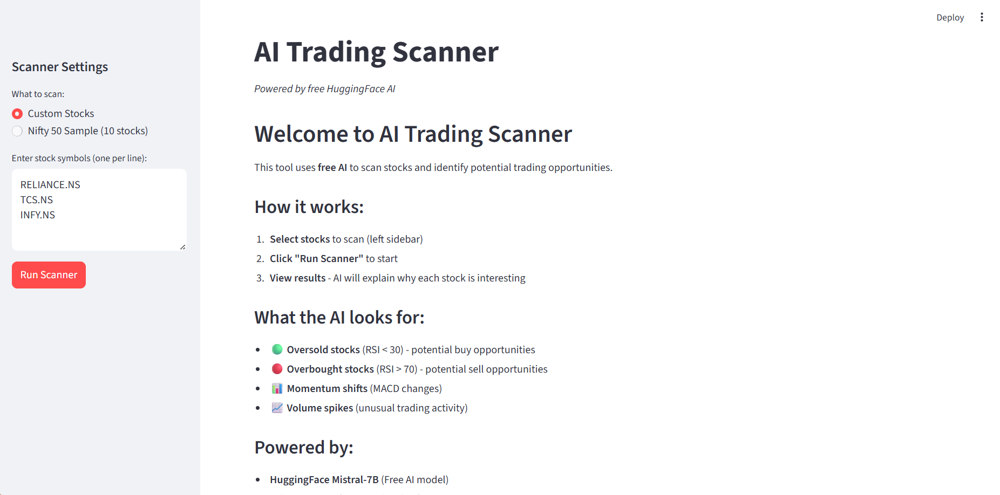
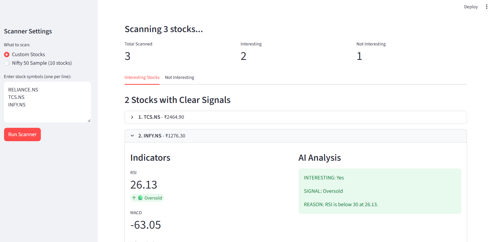
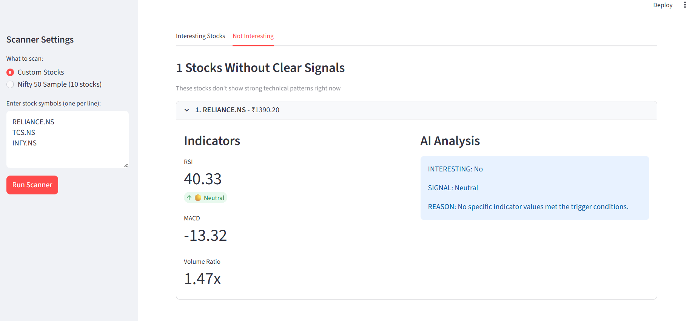
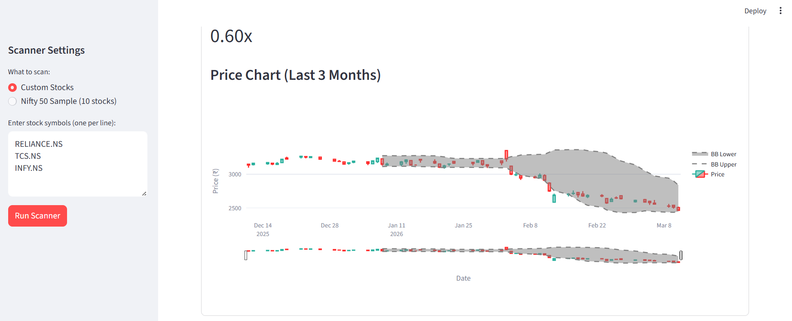
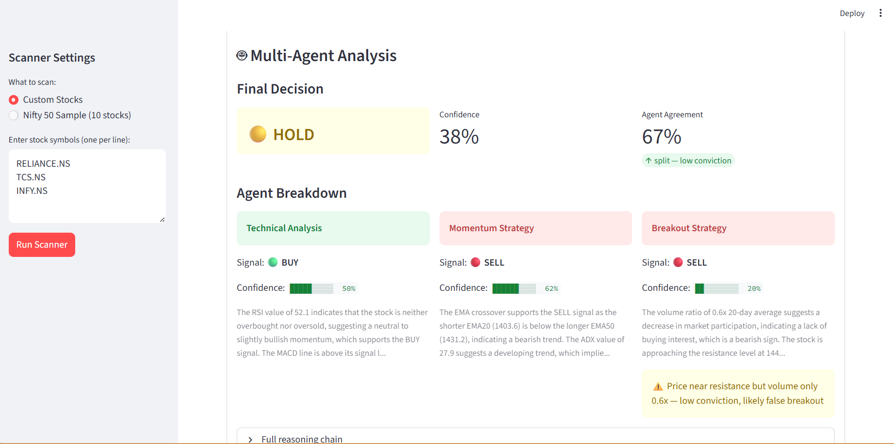

# 🤖 AI Trading Copilot

<div align="center">

[](https://www.python.org/downloads/)
[](https://github.com/langchain-ai/langgraph)
[](https://streamlit.io/)
[](https://huggingface.co/)
[](https://opensource.org/licenses/MIT)

**An intelligent trading system that uses free AI to scan stocks, identify trading opportunities, and simulate paper trades with full order lifecycle management**

[Features](#-features) • [Demo](#-screenshots) • [Quick Start](#-quick-start) • [How It Works](#-how-it-works) • [Tech Stack](#-built-with)

</div>

---

## 🎯 What This Does

Scans stocks using **100% free AI**, evaluates risk, and lets you **paper trade** — all in one dashboard:

- 📊 **Calculates indicators** - RSI, MACD, Bollinger Bands, EMA, ADX, ATR, Volume analysis
- 🤖 **Multi-agent AI analysis** - 3 specialized LangGraph agents (Technical, Momentum, Breakout) run in parallel and vote on each stock
- 🛡️ **Risk management** - Kelly Criterion / ATR-based position sizing, pre-trade hard limits, portfolio-level circuit breakers
- 📋 **Paper trading** - One-click simulated order execution with live Yahoo Finance prices, slippage modeling, and SQLite persistence
- 📌 **Open positions tracking** - Live P&L, R-multiple, and manual close buttons
- ⚡ **Auto-trade mode** - Automatically paper-trades BUY signals above a configurable confidence threshold
- 💯 **100% Free** - No API costs, uses open-source HuggingFace models

**Example output:**
```
✅ RELIANCE.NS - 2,847.50
Multi-Agent Signal: 🟢 BUY  |  Confidence: 78%  |  Agreement: unanimous

Technical Agent:  BUY  - RSI 29.4 oversold, MACD positive crossover
Momentum Agent:   BUY  - EMA20 > EMA50, ADX 32 (strong trend)
Breakout Agent:   HOLD - Volume 1.4× (no breakout confirmation)

Risk: 25 shares  |  Capital at Risk: 4,271  |  ✅ Risk Check Passed
Paper Fill: 25 × RELIANCE.NS @ 2,849.93 (slippage +2.43)
```

---

## 📸 Screenshots

### Dashboard Overview
> *Clean, professional interface for scanning stocks*



### Scanner Results - Interesting Stocks
> *AI identifies stocks with clear technical signals*



### Not Interesting Stocks - Full Transparency
> *See why AI skipped certain stocks*



### Interactive Price Charts
> *Candlestick charts with Bollinger Bands and indicators*



### Multi-Agent Dashboard
> *Per-agent signal cards, confidence bars, and full reasoning chain*



**📹 Demo Video Coming Soon!**

---

## ✨ Features

**Sprint 1 - Complete ✅**

* ✅ **Market data collection** - Fetches stock prices from Yahoo Finance
* ✅ **Technical indicators** - RSI, MACD, Bollinger Bands (manual calculation)
* ✅ **AI Scanner Agent** - Uses free HuggingFace Llama-3-8B model via `InferenceClient`
* ✅ **Strict classification** - Pre-computed trigger hints prevent AI from over-flagging
* ✅ **Rule-based fallback** - Works even if AI model is unavailable
* ✅ **Streamlit Dashboard** - Professional UI with interactive charts
* ✅ **100% Free** - No API costs

**Sprint 2 - Complete ✅**

* ✅ **Multi-agent orchestration** - LangGraph StateGraph coordinates 3 specialized agents in parallel
* ✅ **TechnicalAnalysisAgent** - Oscillator signals (RSI, MACD, Bollinger Bands)
* ✅ **MomentumStrategyAgent** - Trend-following via EMA crossovers and ADX strength gate
* ✅ **BreakoutStrategyAgent** - Volume-confirmed price breakout detection with ATR validation
* ✅ **Typed state management** - Single `TradingState` schema flows through entire agent pipeline
* ✅ **Confidence scoring** - Weighted aggregation with agreement penalty prevents low-conviction trades
* ✅ **Explainable decisions** - Every final signal includes per-agent reasoning breakdown
* ✅ **Multi-agent dashboard** - Per-agent signal cards, confidence bars, and full reasoning chain in UI

**Sprint 3 - Complete ✅**

* ✅ **Position sizing engine** - Fixed fractional (default), Kelly Criterion, and ATR-based sizing
* ✅ **Pre-trade validator** - Hard limits gate: 5% max position, 2% daily loss circuit breaker, 5 max open positions, 30% sector cap
* ✅ **Portfolio risk aggregator** - Tracks open positions, sector exposure, and daily P&L in real time
* ✅ **Risk sidebar** - Live portfolio metrics panel in Streamlit: deployment %, risk %, position slots, sector exposure bars
* ✅ **Per-trade risk verdict** - Every BUY signal shows suggested shares, capital at risk, and pass/fail verdict

**Sprint 4 - Complete ✅**

* ✅ **Execution abstraction layer** - `BrokerInterface` strategy pattern decouples order routing from broker logic
* ✅ **`RiskDecision` → `Order` contract** - Clean handoff from risk engine to execution layer
* ✅ **`PaperBroker`** - Fills orders at live Yahoo Finance prices with configurable slippage (default 5 bps)
* ✅ **`OrderManager`** - Idempotency guarantee: same `order_id` never submits twice; persists every state change
* ✅ **SQLite persistence** - `data/trades.db` stores full order lifecycle (PENDING → FILLED → CLOSED/STOPPED_OUT)
* ✅ **Open positions table** - Live view of all FILLED orders with one-click manual close + P&L display
* ✅ **Auto-trade toggle** — Sidebar toggle + confidence slider; auto-trades BUY signals above threshold
* ✅ **R-multiple reporting** — Each closed trade reports pnl, pnl_pct, and R-multiple (pnl / capital_at_risk)
* ✅ **Order lifecycle state machine** — PENDING → FILLED → CLOSED / STOPPED_OUT with full timestamp trail

## 🔜 Upcoming Sprints

* **Sprint 5:** Trade journal & analytics (equity curves, win rate, avg R, drawdown metrics)
* **Sprint 6:** Production deployment (Docker, CI/CD, monitoring)

---

## 🛠️ Built With

<div align="center">


</div>

**Core Technologies:**
- **Language:** Python 3.11+
- **AI Framework:** LangChain, LangGraph
- **AI Model:** Meta Llama-3-8B-Instruct (free via HuggingFace)
- **Data:** yfinance (market data), pandas, numpy
- **UI:** Streamlit, Plotly (interactive charts)
- **Persistence:** SQLite (`data/trades.db`), upgradeable to PostgreSQL in Sprint 5
- **Dev Tools:** pytest, python-dotenv, structlog

---

## 🚀 Quick Start

### Prerequisites

- Python 3.11+
- pip
- Free HuggingFace account

### Installation

**1. Clone the repository**
```bash
git clone https://github.com/sohansputhran/ai-trading-copilot.git
cd ai-trading-copilot
```

**2. Install dependencies**
```bash
pip install -r requirements.txt
```

**3. Get your free HuggingFace token**

1. Sign up at [huggingface.co/join](https://huggingface.co/join) (free, no credit card)
2. Go to [huggingface.co/settings/tokens](https://huggingface.co/settings/tokens)
3. Create a new **Read** token
4. Visit [huggingface.co/meta-llama/Meta-Llama-3-8B-Instruct](https://huggingface.co/meta-llama/Meta-Llama-3-8B-Instruct) and **accept the license** (required for Llama access)
5. Copy the token (starts with `hf_...`)

**4. Set up environment**
```bash
# Copy the example
cp .env.example .env

# Edit .env and add your token
# HUGGINGFACE_API_TOKEN=hf_your_token_here
```

**5. Run the dashboard**
```bash
streamlit run streamlit_app/app.py
```

Open http://localhost:8501 in your browser! 🎉

---

## 🎓 How It Works

### Architecture

```
┌──────────────────────────────────────────────────────────────┐
│                  Streamlit Dashboard (UI)                    │
│  - Stock selection & scan controls                           │
│  - Interesting / Not Interesting tabs                        │
│  - Per-agent signal cards + confidence bars                  │
│  - Risk sidebar (deployment %, risk %, sector exposure)      │
│  - Open positions table + manual close buttons               │
│  - Auto-trade toggle + confidence threshold slider           │
└───────────────────────┬──────────────────────────────────────┘
                        │
┌───────────────────────▼──────────────────────────────────────┐
│              Multi-Agent Orchestration Layer                  │
│                (LangGraph StateGraph)                        │
│                                                              │
│  ┌──────────────────┐  ┌──────────────┐  ┌───────────────┐  │
│  │  Technical       │  │  Momentum    │  │  Breakout     │  │
│  │  Analysis Agent  │  │  Strategy    │  │  Strategy     │  │
│  │  RSI/MACD/BB     │  │  EMA + ADX   │  │  Vol + ATR    │  │
│  └────────┬─────────┘  └──────┬───────┘  └──────┬────────┘  │
│           └───────────────────┼──────────────────┘           │
│                               │                              │
│                    ┌──────────▼──────────┐                   │
│                    │      Aggregator     │                   │
│                    │  Weighted scoring + │                   │
│                    │  agreement penalty  │                   │
│                    └──────────┬──────────┘                   │
└───────────────────────────────┼──────────────────────────────┘
                                │
┌───────────────────────────────▼──────────────────────────────┐
│                    Risk Management Layer                     │
│  - PositionSizer (fixed fractional / Kelly / ATR-based)      │
│  - PreTradeValidator (5% position cap, 2% loss circuit)      │
│  - PortfolioRisk (open positions, sector exposure, P&L)      │
└───────────────────────────────┬──────────────────────────────┘
                                │
┌───────────────────────────────▼──────────────────────────────┐
│                     Execution Layer                          │
│  ┌────────────────────┐    ┌──────────────────────────────┐  │
│  │    OrderManager    │    │        PaperBroker           │  │
│  │  - Idempotency     │───▶│  - Live yfinance price fetch │  │
│  │  - SQLite persist  │    │  - Slippage simulation (5bp) │  │
│  │  - Route to broker │    │  - PortfolioRisk sync        │  │
│  └────────────────────┘    └──────────────────────────────┘  │
│               Persists to: data/trades.db (SQLite)           │
└───────────────────────────────┬──────────────────────────────┘
                                │
┌───────────────────────────────▼──────────────────────────────┐
│                    Data Pipeline Layer                       │
│  - Market data (Yahoo Finance / yfinance)                    │
│  - Technical indicators: RSI, MACD, BB, EMA, ADX, ATR       │
│  - Scanner Agent (HuggingFace Llama-3-8B)                    │
└──────────────────────────────────────────────────────────────┘
```

### Step-by-Step Flow

**1. Data Collection**
```python
collector = MarketDataCollector()
data = collector.fetch_data("RELIANCE.NS", period="3mo")
# Returns: DataFrame with Open, High, Low, Close, Volume
```

**2. Calculate Indicators**
```python
calculator = SimpleTechnicalIndicators()
data_with_indicators = calculator.calculate_all(data)
# Adds: RSI, MACD, Bollinger Bands, EMA, ADX, ATR, Volume MA
```

**3. Multi-Agent Analysis**
```python
orchestrator = MultiAgentOrchestrator(
    technical_agent=TechnicalAnalysisAgent(llm_client=...),
    momentum_agent=MomentumStrategyAgent(llm_client=...),
    breakout_agent=BreakoutStrategyAgent(llm_client=...),
)
multi_result = orchestrator.analyze(symbol, market_data, indicators)
# Returns: TradingState with per-agent analyses + final aggregated signal
# final_signal: BUY/SELL → "Interesting" | HOLD → "Not Interesting"
```

**4. Risk Assessment**
```python
size = position_sizer.calculate(entry_price, stop_loss, atr, confidence)
validation = validator.validate(symbol, size.position_value, portfolio_value, ...)
# Hard limits: 5% max position, 2% daily loss, 5 open positions, 30% sector
```

**5. Paper Trade Execution**
```python
manager = OrderManager(broker=PaperBroker(portfolio), db_path="data/trades.db")
order = manager.submit(risk_decision, order_id="abc-123")
# - Idempotency: same order_id returns existing order without re-submitting
# - PaperBroker re-fetches live price at fill time (not scan time)
# - Applies 5 bps slippage (adverse direction)
# - Persists PENDING → FILLED to SQLite

# Close a position:
closed = manager.close_position(order_id, reason="manual")
# Calculates: gross_pnl, pnl_pct, r_multiple (pnl / capital_at_risk)
```

**6. Dashboard Display**
```bash
streamlit run streamlit_app/app.py
# Shows:
#   - Tab 1: Interesting stocks (BUY/SELL from multi-agent system)
#   - Tab 2: Not Interesting (HOLD or low-confidence signals)
#   - Each stock: per-agent breakdown + confidence + risk assessment + Paper Trade button
#   - Open positions table with live P&L and close buttons
#   - Auto-trade toggle in sidebar
```

---

## 📊 Technical Indicators Explained

### RSI (Relative Strength Index)
- **Range:** 0-100
- **< 30:** Oversold 🟢 (potential buy opportunity)
- **> 70:** Overbought 🔴 (potential sell/caution)
- **30-70:** Neutral 🟡

### MACD (Moving Average Convergence Divergence)
- **Positive:** Bullish trend (momentum up)
- **Negative:** Bearish trend (momentum down)
- **Crossover:** Potential buy/sell signal

### Bollinger Bands
- **Upper Band:** Price + 2× std deviation
- **Lower Band:** Price - 2× std deviation
- **Price near upper:** Potentially overbought
- **Price near lower:** Potentially oversold
- **Bands squeeze:** Low volatility (breakout coming)

### EMA Crossover (Momentum Agent)
- **EMA20 > EMA50:** Short-term trend above long-term → bullish
- **EMA20 < EMA50:** Short-term trend below long-term → bearish
- **ADX > 25:** Trend strength gate (filters choppy markets)

### ATR (Average True Range)
- **Used for:** Stop-loss placement (1.5× ATR below entry) and position sizing
- **Higher ATR:** More volatile stock → smaller position size

### Volume Ratio
- **> 2.0×:** Unusual activity (institutional interest?)
- **1.0-2.0×:** Normal trading
- **< 1.0×:** Below average (low interest)

---

## 🤖 AI Model & Fallback System

### Primary: Meta Llama-3-8B-Instruct

**Why this model?**
- ✅ 100% free (no API costs)
- ✅ Open-source and reliable
- ✅ Strong instruction-following
- ✅ Good at structured output

**Fallback Chain (if primary fails):**
1. `meta-llama/Meta-Llama-3-8B-Instruct`
2. `google/flan-t5-large`
3. `HuggingFaceH4/zephyr-7b-beta`
4. **Rule-based logic** (always works)

### Smart Fallback System

**Per-stock fallback:**
```python
# For each stock:
try:
    analysis = ai_model.analyze(stock)  # Try AI
except:
    analysis = rule_based_analysis(stock)  # Fallback to rules
    
# Scan always completes!
```

---

## 📋 Paper Trading System (Sprint 4)

### Order Lifecycle

```
PENDING ──> FILLED ──> CLOSED       (manual exit or take-profit)
                  └──> STOPPED_OUT  (stop-loss hit)
        └──> REJECTED               (could not fetch live price)
        └──> CANCELLED              (user cancelled before fill)
```

### Key Design Decisions

| Decision | Rationale |
|----------|-----------|
| **Re-fetch price at fill time** | Prices move between scan (10:30) and click (10:35). The fill uses the live price, not the stale scan price. |
| **Slippage simulation (5 bps)** | Real market orders don't fill at mid-price. BUYs pay slightly above, SELLs receive slightly below. |
| **Idempotency via `order_id`** | Prevents duplicate fills if the button is double-clicked or the network retries. Same ID → same order returned unchanged. |
| **SQLite for Sprint 4** | No PostgreSQL server required. Schema is written for PostgreSQL compatibility — just swap the connection string in Sprint 5. |
| **Separate `PaperBroker` and `OrderManager`** | Single responsibility. The broker fills orders; it has no DB knowledge. The manager handles DB; it has no execution logic. |

### R-Multiple

Every closed trade reports an **R-multiple** — the gold standard in professional trading:

```
R-multiple = gross_pnl / capital_at_risk

+2R = made 2× what was risked (excellent)
+1R = made exactly what was risked (good)
-1R = stop-loss was hit exactly (expected worst case)
< -1R = slippage pushed loss beyond stop
```

---

## 🧪 Testing

### Unit tests — no external dependencies needed
Tests state schema, agent signal logic, aggregator math, risk engine logic, and the full execution layer (OrderManager + PaperBroker with a mock broker and in-memory SQLite).
```bash
pytest tests/test_agents.py tests/test_risk.py tests/test_execution.py -v
```

### Integration tests — requires LangGraph
Tests the full LangGraph pipeline end-to-end using mock agents. Auto-skipped if LangGraph is not installed.
```bash
pytest tests/test_orchestrator.py -v
```

### Run all tests
```bash
pytest tests/ -v
```

---

## 📁 Project Structure

```
ai-trading-copilot/
├── src/
│   ├── agents/
│   │   ├── scanner_agent.py        # AI scanner using HuggingFace
│   │   ├── state.py                # TradingState schema (LangGraph)
│   │   ├── base_agent.py           # Abstract base for all agents
│   │   ├── technical_agent.py      # RSI/MACD/BB oscillator agent
│   │   ├── momentum_agent.py       # EMA crossover + ADX trend agent
│   │   ├── breakout_agent.py       # Volume + ATR breakout agent
│   │   ├── aggregator.py           # Weighted multi-agent aggregator
│   │   └── orchestrator.py         # LangGraph StateGraph coordinator
│   ├── data_pipeline/
│   │   ├── collector.py            # Fetches stock data (Yahoo Finance)
│   │   └── indicators.py           # Technical indicators (manual calculation)
│   ├── execution/                  # ← NEW in Sprint 4
│   │   ├── broker.py               # BrokerInterface + Order + RiskDecision dataclasses
│   │   ├── paper_broker.py         # PaperBroker: live yfinance price + slippage
│   │   ├── order_manager.py        # Idempotency + SQLite persistence + routing
│   │   └── schema.sql              # PostgreSQL-compatible trades table schema
│   ├── risk_management/
│   │   ├── position_sizer.py       # Kelly / fixed fractional / ATR sizing
│   │   ├── validators.py           # Pre-trade hard limit gate
│   │   └── portfolio.py            # Open position tracker + portfolio snapshot
│   └── utils/
│       └── config.py               # Loads environment variables
├── streamlit_app/
│   ├── app.py                      # Dashboard UI (scanning, multi-agent, risk, paper trading)
│   └── components/
│       └── risk_sidebar.py         # Portfolio risk sidebar component
├── tests/
│   ├── test_agents.py              # Unit tests for agents & state (no external deps)
│   ├── test_orchestrator.py        # Integration tests (requires LangGraph)
│   ├── test_risk.py                # Risk engine unit tests (no external deps)
│   └── test_execution.py           # Execution layer unit tests (mock broker, :memory: DB)
├── data/
│   └── trades.db                   # SQLite paper trade history (auto-created on first run)
├── configs/                        # Config files
├── requirements.txt                # Python dependencies
├── .env.example                    # Environment template
└── README.md                       # This file
```

---

## 💼 Why This Project Matters

### Skills Demonstrated

This project showcases:

✅ **AI Engineering** - Multi-agent systems, prompt engineering, model selection & fallback strategies  
✅ **Software Architecture** - Strategy pattern (BrokerInterface), clean layer separation, idempotency design  
✅ **Risk Management** - Kelly Criterion, position sizing algorithms, circuit breakers, portfolio-level constraints  
✅ **Production Code** - Error handling, fallbacks, logging, type hints, modular design  
✅ **Data Engineering** - Real-time pipelines, caching strategies, data validation  
✅ **Full-Stack Development** - Backend (Python), Frontend (Streamlit), API integration  
✅ **Database Design** - SQLite persistence with PostgreSQL-compatible schema, state machine modeling  
✅ **Domain Knowledge** - Financial indicators, technical analysis, risk-reward frameworks, order lifecycle  

**Tech Stack:** Python, LangChain, LangGraph, HuggingFace, Streamlit, Pandas, NumPy, Plotly, SQLite, Git

### Learning Journey

Built over **8 weeks** as part of a 12-week AI Engineering learning project:
- **Sprint 1:** Real-time data pipelines, technical indicators, HuggingFace AI scanner
- **Sprint 2:** Multi-agent orchestration, parallel LangGraph StateGraph, confidence scoring, explainable AI
- **Sprint 3:** Risk algorithms (Kelly Criterion, fixed fractional, ATR-based sizing), pre-trade validation, portfolio-level circuit breakers
- **Sprint 4:** Execution layer (BrokerInterface, PaperBroker, OrderManager), idempotency, SQLite persistence, auto-trade mode
- Implemented production-grade error handling and fallback chains throughout
- 70+ passing tests (unit + integration) covering state, agents, orchestration, risk logic, and execution

---

## ⚠️ Important Disclaimers

### Not Financial Advice

- 📚 Built as a **learning project** for AI Engineering
- 🎓 For **educational purposes only**
- 🔍 Always do your own research before trading
- 💰 Never invest more than you can afford to lose
- ⚖️ Not a registered investment advisor

### Data & AI Limitations

- **Yahoo Finance data** may have delays (not real-time)
- **Technical indicators** are backward-looking (past ≠ future)
- **AI can make mistakes** - use as one input, not sole decision maker
- **Open-source models** less sophisticated than paid alternatives (Claude, GPT-4)
- **Paper trading** simulates execution but cannot guarantee real-world fill prices

---

## 🔧 Troubleshooting

### Common Issues

| Issue | Cause | Solution |
|-------|-------|----------|
| `AI failed, using rule-based` | Model access not granted | Accept Llama-3 license at [huggingface.co/meta-llama/Meta-Llama-3-8B-Instruct](https://huggingface.co/meta-llama/Meta-Llama-3-8B-Instruct) |
| Token error | Invalid/expired token | Regenerate at [huggingface.co/settings/tokens](https://huggingface.co/settings/tokens) |
| No data for stock | Wrong symbol format | Use `.NS` for NSE, `.BO` for BSE (e.g., `RELIANCE.NS`) |
| Module not found | Dependencies not installed | Run `pip install -r requirements.txt` |
| Paper Trade button disabled | Risk check failed | Check risk verdict above the button for rejection reason |
| `data/trades.db` missing | First run only | Auto-created when you click Paper Trade for the first time |

---

## 🤝 Contributing

Contributions welcome! This is a learning project, but improvements are appreciated.

### How to Contribute

1. Fork the repo
2. Create a feature branch (`git checkout -b feature/amazing-feature`)
3. Commit your changes (`git commit -m 'Add amazing feature'`)
4. Push to branch (`git push origin feature/amazing-feature`)
5. Open a Pull Request

### Ideas for Contributions

- 💡 Add more technical indicators (Fibonacci, Ichimoku Cloud)
- 🎨 Improve UI/UX design
- 🧪 Add backtesting capability
- 🌍 Support more exchanges (US stocks via Yahoo)
- 📊 Add sentiment analysis (news, social media)
- 🤖 Improve AI prompts for better analysis
- 🗄️ Upgrade persistence to PostgreSQL (Sprint 5 prep)

---

## 🗺️ Roadmap

### Sprint 1: Foundation ✅ (Complete)
- [x] Market data pipeline
- [x] Technical indicators engine
- [x] AI scanner agent
- [x] Streamlit dashboard
- [x] Rule-based fallback

### Sprint 2: Multi-Agent System ✅ (Complete)
- [x] LangGraph orchestrator (parallel fan-out StateGraph)
- [x] Specialized agents (Technical, Momentum, Breakout)
- [x] Agent reasoning visualization in dashboard
- [x] Confidence scoring + agreement penalty aggregator
- [x] Multi-agent classification (overrides Sprint 1 scanner)

### Sprint 3: Risk Management ✅ (Complete)
- [x] Position sizing engine (fixed fractional, Kelly, ATR-based)
- [x] Pre-trade validator with hard limits (5% position, 2% daily loss, 5 max positions, 30% sector)
- [x] Portfolio risk aggregator (open positions, sector exposure, daily P&L)
- [x] Risk sidebar panel in Streamlit dashboard

### Sprint 4: Paper Trading ✅ (Complete)
- [x] Execution abstraction layer (`BrokerInterface` strategy pattern)
- [x] `PaperBroker` — live price fetch + slippage simulation
- [x] `OrderManager` — idempotency + SQLite persistence
- [x] Order lifecycle state machine (PENDING → FILLED → CLOSED / STOPPED_OUT)
- [x] Open positions table with manual close + P&L display
- [x] Auto-trade toggle + confidence threshold slider
- [x] R-multiple reporting on closed trades

### Sprint 5: Trade Journal (Coming Soon)
- [ ] Equity curve visualization
- [ ] Win rate, average R, Sharpe ratio, max drawdown metrics
- [ ] Trade history page with filtering & export
- [ ] PostgreSQL migration (swap SQLite connection string)

### Sprint 6: Production (Coming Soon)
- [ ] Docker containerization
- [ ] CI/CD pipeline (GitHub Actions)
- [ ] Monitoring & logging (structlog dashboards)
- [ ] Deployment documentation

---

## 📚 Learning Resources

### Technical Analysis
- [Investopedia - Technical Analysis](https://www.investopedia.com/terms/t/technicalanalysis.asp)
- [RSI Explained](https://www.investopedia.com/terms/r/rsi.asp)
- [MACD Explained](https://www.investopedia.com/terms/m/macd.asp)
- [Bollinger Bands Guide](https://www.investopedia.com/terms/b/bollingerbands.asp)

### AI & Agents
- [LangChain Documentation](https://python.langchain.com/)
- [LangGraph Tutorials](https://langchain-ai.github.io/langgraph/)
- [HuggingFace Models](https://huggingface.co/models)
- [Prompt Engineering Guide](https://www.promptingguide.ai/)

### Python & Data Science
- [Pandas Tutorial](https://pandas.pydata.org/docs/getting_started/intro_tutorials/)
- [NumPy Basics](https://numpy.org/doc/stable/user/quickstart.html)
- [Plotly Charts](https://plotly.com/python/)
- [Streamlit Docs](https://docs.streamlit.io/)

### Trading & Risk
- [Van Tharp - R-Multiple](https://www.vantharp.com/tharp-concepts/r-multiples)
- [Kelly Criterion Explained](https://www.investopedia.com/articles/trading/04/091504.asp)
- [Position Sizing Fundamentals](https://www.investopedia.com/terms/p/positionsizing.asp)

---

## 📝 Blog Posts & Articles

*Coming soon! I'll be writing about:*
- Building a Multi-Agent AI Trading Scanner with LangGraph
- Paper Trading Architecture: Idempotency, Slippage & SQLite
- Using Free AI Models for Stock Analysis
- From Idea to Production: 12-Week AI Engineering Journey

---

## 📄 License

MIT License — Feel free to use for learning and personal projects!

See [LICENSE](LICENSE) file for details.

---

## 🙏 Acknowledgments

- **HuggingFace** - Free AI model hosting and inference API
- **Yahoo Finance** - Free, reliable market data
- **Streamlit** - Amazing framework for data apps
- **Meta AI** - Open-source Llama-3-8B model
- **LangChain Team** - Excellent agent framework

---

## 📧 Contact

**Built by:** Sohan  
**Project Type:** AI Engineering Portfolio Project  
**GitHub:** [@sohansputhran](https://github.com/sohansputhran)

---

## ⭐ Show Your Support

If you found this project useful or interesting:

- ⭐ **Star this repo** to show your support
- 🍴 **Fork it** to build your own version
- 📣 **Share it** with others learning AI Engineering
- 💬 **Open an issue** if you have questions or suggestions

---

<div align="center">

**Happy Trading! 🚀**

*Remember: This is a learning tool, not financial advice. Always do your own research.*

</div>
